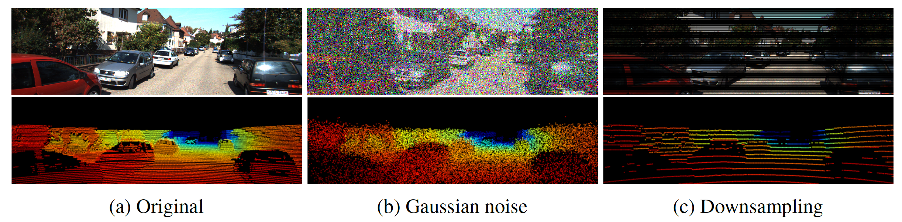

# AVOD for Single Source Robustness
This repository contains the public release of the Python implementation of our robust deep fusion models for single source robustness. We investigate learning fusion algorithms that are robust against noise added to a single source. A recent open-sourced 3D object detector [Aggregate View Object Detection (AVOD)](https://github.com/kujason/avod) is selected as a baseline algorithm to test our strategies for achieving robustness, and we modified the original implementation of the AVOD.

[**On Single Source Robustness in Deep Fusion Models**](https://arxiv.org/abs/1906.04691)

[Taewan Kim](https://sites.google.com/a/utexas.edu/twankim), [Joydeep Ghosh](https://www.ideal.ece.utexas.edu/ghosh/), The University of Texas at Austin

If you use this code, please cite our paper:
```
@article{kim2019single, 
  title={On Single Source Robustness in Deep Fusion Models}, 
  author={Kim, Taewan and Ghosh, Joydeep},
  journal={arXiv preprint arXiv:1906.04691},
  year={2019}
}
```

## Getting Started (Setup for AVOD)
Implemented and tested on Ubuntu 16.04 with Python 3.5 and Tensorflow 1.12.0.
(Similar to required steps of AVOD)

1. Clone this repo
```bash
git clone git@github.com:twankim/avod_ssn.git --recurse-submodules
```

2. Install Python dependencies
```bash
cd avod_ssn
pip3 install -r requirements.txt
pip3 install tensorflow-gpu==1.3.0 (or tensorflow-gpu==1.12.0)
```

3. Add `avod_ssn (top level)` and `wavedata` to your PYTHONPATH (Not required after installation)
```bash
# For virtualenvwrapper users
add2virtualenv .
add2virtualenv wavedata
```

```bash
# For nonvirtualenv users
export PYTHONPATH=$PYTHONPATH:'/path/to/avod_ssn'
export PYTHONPATH=$PYTHONPATH:'/path/to/avod_ssn/wavedata'
```

4. Compile integral image library in wavedata
```bash
sh scripts/install/build_integral_image_lib.bash
```

5. AVOD uses Protobufs to configure model and training parameters. Before the framework can be used, the protos must be compiled (from top level avod folder):
```bash
sh avod/protos/run_protoc.sh
```

Alternatively, you can run the `protoc` command directly:
```bash
protoc avod/protos/*.proto --python_out=.
```

### Dataset
Follow the Dataset and Mini-batch Generation setups of the original [AVOD repository](https://github.com/kujason/avod) to prepare for training and inference.

## Scripts and Configs
AVOD provides several options in fusion strategies: (i) fusion methods *(mean/concat)* in RPN, (ii) fusion methods *(mean/concat/max)* and fusion types *(early/late/deep)* in fully_connected layers. Our implementation uses *early fusion* type in fusion fc_layers, and one more fusion method *LEL(latent esemble layer)* is added to the list of fusion methods for both RPN and fc layers. Our scripts and configs assume that the 3D detector is detecting the *Car* class of KITTI dataset. 

### Types of Noise/Corruption
*Gaussian noise* and *downsampling* methods are tested in our implementation. Levels and types of corruption can be controlled by an argument `sin_type` and `sin_level` in config files, which will be passed to the python file `utils_sin/sin_utils.py`.


(Different types of corruption added to input sources)

### Models Trained on Clean Data
A subdirectory `avod_ssn/scripts/sin_test` includes all the required scripts for our experimental results, and corresponding config files are located at `avod_ssn/avod/configs`. (Any subfolder or file name includes a term *simple* is for the model using an element-wise mean fusion method.) 

To train the model on clean data, see the script files `scripts/sin_test/rand_5/{run_pyramid_cars_with_aug_simple.sh,run_pyramid_cars_with_aug_concat.sh,run_pyramid_cars_with_aug_lel.sh}`, which include following processes:
1. Train a model on clean data
2. Evaluate the model on validation set (clean data)
3. Evaluate the model on validation set (Gaussian single source noise is applied)
4. Evaluate the model on validation set (Gaussian all source noise is applied)

(For the downsampling corruption, see the files at `scripts/sin_test/lowres_4`.)

### Models Trained on Corrupted Data
There are two types of strategies that we can use to train models for corrupted data. First, the subdirectory `scripts/sin_test/rand_5` provides scripts for *fine-tuning* the models with noisy data. Details can be found in our paper. Then, `scripts/sin_test/rand_5_full` provides the scripts for training the whole model from the scratch with corrupted data.

### Viewing Results
All results should be saved in `/data/ktti_avod/object/outputs`. Here you should see `offline_eval` which provides text files saving different AP scores per predefined checkpoints of a model. You can also generate visualization of the corrupted sources by running a code `avod_ssn/utils_sin/viz_sample_ex.py`.

## LICENSE
Copyright (c) 2019 [Taewan Kim](https://sites.google.com/a/utexas.edu/twankim)

(*Original AVOD (2018): [Jason Ku](https://github.com/kujason), [Melissa Mozifian](https://github.com/melfm), [Ali Harakeh](www.aharakeh.com), [Steven L. Waslander](http://wavelab.uwaterloo.ca)*)

Permission is hereby granted, free of charge, to any person obtaining a copy
of this software and associated documentation files (the "Software"), to deal
in the Software without restriction, including without limitation the rights
to use, copy, modify, merge, publish, distribute, sublicense, and/or sell
copies of the Software, and to permit persons to whom the Software is
furnished to do so, subject to the following conditions:

The above copyright notice and this permission notice shall be included in all
copies or substantial portions of the Software.

THE SOFTWARE IS PROVIDED "AS IS", WITHOUT WARRANTY OF ANY KIND, EXPRESS OR
IMPLIED, INCLUDING BUT NOT LIMITED TO THE WARRANTIES OF MERCHANTABILITY,
FITNESS FOR A PARTICULAR PURPOSE AND NONINFRINGEMENT. IN NO EVENT SHALL THE
AUTHORS OR COPYRIGHT HOLDERS BE LIABLE FOR ANY CLAIM, DAMAGES OR OTHER
LIABILITY, WHETHER IN AN ACTION OF CONTRACT, TORT OR OTHERWISE, ARISING FROM,
OUT OF OR IN CONNECTION WITH THE SOFTWARE OR THE USE OR OTHER DEALINGS IN THE
SOFTWARE.